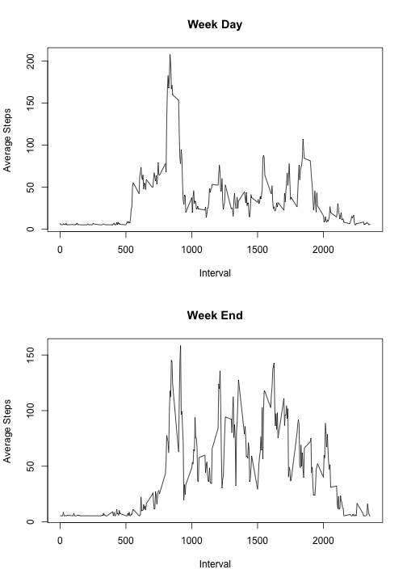

<!-- global options, can override in code chunk header -->


# Loading and preprocessing the data


```r
  setwd("~/Documents/My Documents/Coursera/DataScienceTrack/ReproducableResearch/project1Git")
  fileURL <- "https://d396qusza40orc.cloudfront.net/repdata%2Fdata%2Factivity.zip"
  if(!file.exists("repdata_data_activity.zip")) {
          temp <- tempfile()
          download.file(fileURL,destfile=temp,method="curl")
	  dateDownLoaded <- date()
          file <- unzip(temp)
          unlink(temp)
    }

    column.class <- c("numeric", "character", "numeric")
    temp2 <- read.table("activity.csv", sep=',',header=TRUE, colClasses=column.class)
    myActivity <- transform(temp2, date = as.Date(date,"%Y-%m-%d"))
```

# What is mean total number of steps taken per day? (Ignore Missings)

1. Calculate the total number of steps taken per day
 

```r
   library(plyr)

    with(myActivity, tapply(steps,as.factor(weekdays(date)),sum,na.rm=TRUE))
```

```
##    Friday    Monday  Saturday    Sunday  Thursday   Tuesday Wednesday 
##     86518     69824     87748     85944     65702     80546     94326
```
   
2.  Make a histogram of the total number of steps taken each day


```r
    hist(with(myActivity, tapply(steps,as.factor(weekdays(date)),sum,na.rm=TRUE)), breaks=10, main="Historgram of Total Number of Steps per Day",xlab="Total Steps", col="magenta")
```


3. Calculate and report the mean and median of the total number of steps taken per day


```r
    mean(with(myActivity, tapply(steps,as.factor(weekdays(date)),sum,na.rm=TRUE)))
```

```
## [1] 81515.43
```

```r
    median(with(myActivity, tapply(steps,as.factor(weekdays(date)),sum,na.rm=TRUE)))
```

```
## [1] 85944
```


# What is the average daily activity pattern?

 1.  Make a time series plot (i.e. type = "l") of the 5-minute interval (x-axis) and the average number of steps taken, averaged across all days (y-axis)


```r
     with(myActivity, plot(unique(interval), tapply(steps,as.factor(interval),mean,na.rm=TRUE),type="l",xlab="5-Min Interval",ylab="Mean Steps",main="Interval vs. Mean Steps"))
```


 2.  Which 5-minute interval, on average across all the days in the dataset, contains the maximum number of steps?


```r
     maxAvgInt <- which.max(with(myActivity, tapply(steps,as.factor(interval),mean,na.rm=TRUE)))
```
The maximum average inteval is: 835.

# Impute missing values

1.    Calculate and report the total number of missing values in the dataset (i.e. the total number of rows with NAs)


```r
      library(Amelia)
        missmap(myActivity,y.labels=FALSE,y.at=NULL)
```


```r
        nrow(myActivity) - nrow(na.omit(myActivity))
```

```
## [1] 2304
```

2.    Devise a strategy for filling in all of the missing values in the dataset using the mean/median for that day
      and create a new dataset that is equal to the original dataset but with the missing data filled in.


```r
       library(plyr)
       myActivityImp = ddply(myActivity, .(dayOfWeek = weekdays(date)), transform, steps=ifelse(is.na(steps), mean(steps, na.rm=TRUE), steps))
```


3.    Make a histogram of the total number of steps taken each day and Calculate and report the mean and median total number of steps taken per day. 
      (Do these values differ from the estimates from the first part of the assignment? What is the impact of imputing missing data on the 
       estimates of the total daily number of steps?)


```r
    hist(with(myActivityImp, tapply(steps,as.factor(weekdays(date)),sum,na.rm=TRUE)), breaks=5, main="Historgram of Total Steps per Day (NA's Imputed)",xlab="Total Steps", col="magenta")
```


```r
    mean(with(myActivityImp, tapply(steps,as.factor(weekdays(date)),sum,na.rm=TRUE)))
```

```
## [1] 94299.11
```

```r
    median(with(myActivityImp, tapply(steps,as.factor(weekdays(date)),sum,na.rm=TRUE)))
```

```
## [1] 98221.71
```


# Are there differences in activity patterns between weekdays and weekends?

   ## For this part the weekdays() function may be of some help here. Use the dataset with the filled-in missing values for this part.

    - Create a new factor variable in the dataset with two levels – “weekday” and “weekend” indicating whether a given date is a weekday or weekend day.


```r
    myActivityImp$dayType <- ifelse(myActivityImp$dayOfWeek %in% c("Saturday","Sunday"), "weekend", "weekday")
```

    - Make a panel plot containing a time series plot (i.e. type = "l") of the 5-minute interval (x-axis) and the  average number of steps taken, averaged across all weekday days or weekend days (y-axis). 


```r
   weekday <- subset(myActivityImp,dayType=="weekday"); weekend <- subset(myActivityImp,dayType=="weekend")
   par(mfrow=c(2,1))
   with(weekday, plot(unique(interval),tapply(steps,as.factor(interval),mean,na.rm=TRUE),type="l", ylab='Average Steps', xlab='Interval', main='Week Day'))
   with(weekend, plot(unique(interval),tapply(steps,as.factor(interval),mean,na.rm=TRUE),type="l", ylab='Average Steps', xlab='Interval', main='Week End'))
```




